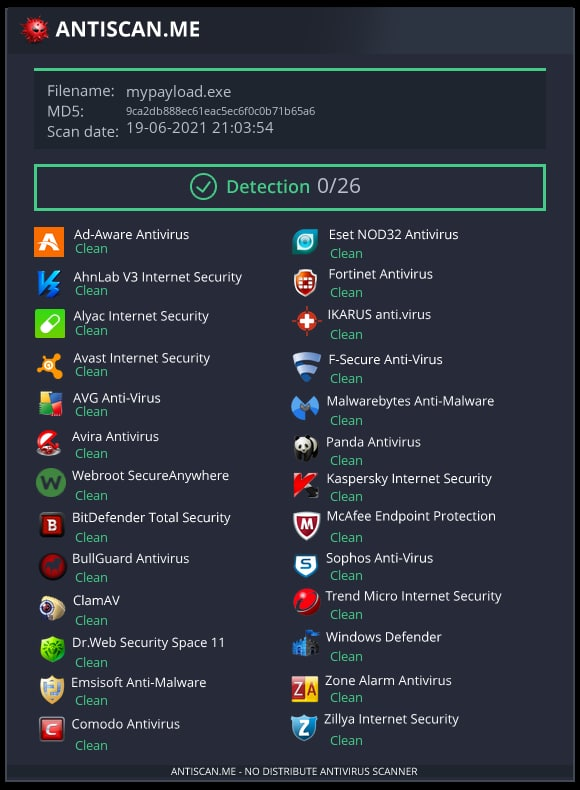
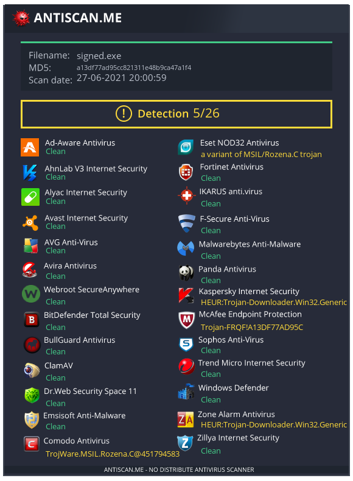

# windowsPayload
Tool to generate stable undetected payload

Don't Upload to Virus Total!

# ScreenShots

# How to install + use
* git clone https://github.com/drgreenthumb93/PayloadGen
* cd PayloadGen
* python3 generate.py
* if you are On linux Install Py on Wine and Compile using pyinstaller (I recommend to Use Windows For Compiling)

## Features
- [x] Create Payload With MsfVenom Automated
- [x] Creates a handler.rc file
- [x] Undetectable 
- [x] Stop Sec Services And Kill Av Process
- [x] AutoPortForwarding(Ngrok) 
- [x] Obfuscate Payload 
- [x] Can Make VBS Dropper  
- [x] Can Make HTA Attack
- [x] Auto Exe signing
- [x] Generate Android Payloads 

# C# Payload Detection
 

<h2>Video</h2>
 
